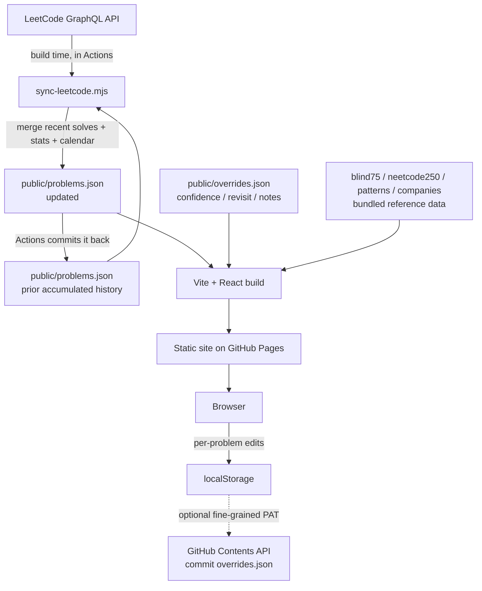

# DSA Dojo 🥋

**A personal LeetCode tracker that syncs itself from my public LeetCode profile and turns interview grinding into a game — belts, patterns, and famous problem lists — with zero manual data entry.**

🔗 **Live:** https://shiva-shivanibokka.github.io/dsa-dojo/

> ### Recruiter TL;DR
> - **What it is:** a self-updating dashboard over my LeetCode activity — every solved problem, auto-fetched with its difficulty and official topic tags, visualized and gamified (karate-belt progression, pattern coverage, Blind 75 / NeetCode 250 progress).
> - **Hardest problem solved:** LeetCode's public API only exposes your *most recent* solves, not full history — so the sync is built as an **accumulator** that merges new solves into a committed JSON on a schedule and commits it back, growing a complete history forward with no manual entry.
> - **Runs itself:** a daily GitHub Actions pipeline pulls fresh data, commits the accumulated history, and redeploys — new solves show up on their own.

---

## Overview — why this exists

Interview prep on LeetCode is a long grind, and the platform's own UI doesn't make *progress* feel visible: you can't easily see which patterns you've actually covered, how you're tracking against the well-known interview lists (Blind 75, NeetCode 250), or which problems you personally found shaky and should revisit.

DSA Dojo is my answer to that — a single, motivating dashboard built on top of my real LeetCode data. It's a portfolio project *and* a tool I actually use to steer my prep: it tells me what patterns I still haven't touched, resurfaces problems I flagged, and gives me a karate-belt to climb toward a 1,500-problem goal.

## Features

- **Auto-synced from LeetCode** — a build-time script hits LeetCode's GraphQL API (in CI, so no browser/CORS limits) for solved-by-difficulty stats, ranking, current streak, the submission calendar, and recent accepted problems with their **official topic tags** and solve dates.
- **The accumulator** — because LeetCode only exposes *recent* solves publicly, each run merges newly-seen problems into `public/problems.json` and commits it back, building a complete forward history automatically.
- **Solved mosaic** — one auto-fitting square per solved problem, colored by difficulty; the grid resizes itself as the count grows, and clicking a square jumps to that problem below.
- **Belt system** — karate-belt progression by solved count (White → … → Black at 1,500+), with a live progress bar and a full belt ladder; the current belt's border animates.
- **Activity heatmap** — a GitHub-style calendar of daily submissions over the past year, keyed on your local day so a solve lands on the cell for the "today" you actually see.
- **Interview-list progress** — live **Blind 75** and **NeetCode 250** completion, each with an expandable checklist of what's left (linked to LeetCode).
- **NeetCode 250 roadmap board** — the full 250-problem roadmap grouped into its 18 categories (Arrays & Hashing, Two Pointers, … Bit Manipulation) as an accordion; every problem carries an Easy / Medium / Hard difficulty tag, each category shows a `done / total` progress bar, and anything you've already solved on LeetCode auto-checks off by slug. A **to-do-only** toggle hides everything you've finished so you see just what's left.
- **"Patterns to learn next"** — a gap analysis of core interview patterns you haven't solved a single problem for yet (Trees, Graphs, DP, Backtracking, …).
- **Group-by-pattern view & filters** — filter by difficulty or pattern (from official tags), search, sort, or collapse the board into per-pattern sections.
- **Per-problem controls** — confidence (Solid / Shaky / Forgot), a ⭐ revisit flag, and freeform notes; a clear that removes a value now sticks even against the committed baseline.
- **Spaced-repetition Review Queue** — problems that are due to be reviewed, most-overdue first (review interval keyed off your confidence rating); rate your recall and hit **Reviewed** to reset the clock. Starred problems always surface.
- **One-click "Sync now"** — with a write-back token set, a button kicks off the deploy workflow, watches the run, and auto-reloads when your latest solves land (~1 min) — no waiting for the daily cron.
- **Company tags** — a "commonly asked at" list per problem (see the honest note under *Data sources*).
- **Living starfield UI** — deep-space canvas with drifting stars and shooting meteors, neon glass cards, and a Tourney display font.

## Architecture

Like a static site should be: **all data-fetching happens at build time inside CI**, and the browser only ever reads a committed JSON. The one non-obvious piece is the accumulator, which exists specifically because the upstream API can't give full history in a single call.



**Why this shape:**
- **Accumulator over a single fetch** — the public API returns only recent accepted submissions, so a one-shot sync would keep losing older history. Persisting a merged JSON back to the repo each run turns an incomplete endpoint into a complete, growing dataset. It also degrades safely: if the profile or calendar query fails on a given run, the last good stats are preserved instead of zeroed, and any entry stored earlier with fallback data (missing id / empty tags) is re-enriched on a later run rather than baked in.
- **Build-time fetch in CI** — LeetCode's GraphQL endpoint blocks browser cross-origin requests; running the fetch in a Node step inside Actions sidesteps CORS entirely and keeps the client a pure static reader.
- **Reference lists as bundled data** — Blind 75, NeetCode 250, the canonical pattern list, and the company map are static data files, matched against solved slugs client-side. No runtime dependency.

## Tech Stack

Read from `package.json`:

| Layer | Choice | Notes |
| --- | --- | --- |
| Build | **Vite 5** | static build for GitHub Pages (`base: '/dsa-dojo/'`) |
| UI | **React 18 + TypeScript 5** | typed components, strict mode |
| Styling | **Tailwind CSS 3** | starfield dark palette; Tourney / Space Grotesk / JetBrains Mono |
| Sync | **Node (ESM) script** | `fetch` against LeetCode's GraphQL API; no runtime deps |
| Viz | **HTML canvas** | starfield/meteors background + auto-fitting solved mosaic |
| CI/CD | **GitHub Actions → Pages** | sync → commit history → build → deploy (daily cron + push + manual dispatch); hardened deploy step |

## Skills Demonstrated

- **API integration under real constraints** — working around an upstream API that returns partial history and blocks CORS, via a CI-side accumulator pattern.
- **Data modeling & client-side analysis** — pattern-coverage gap analysis, interview-list matching, and difficulty/streak aggregation over the synced dataset.
- **CI/CD automation** — a self-scheduling Actions pipeline that fetches, commits derived state, and redeploys with no manual step.
- **Frontend engineering** — React + TypeScript + Tailwind, responsive canvas visualizations (auto-fitting mosaic, animated starfield), custom portal dropdowns, `localStorage` state with optional remote commit.
- **Secrets hygiene** — sync runs with no credentials (public profile); the optional write-back PAT lives only in the browser, never committed or sent anywhere but GitHub.

## Getting Started

```bash
npm install
npm run sync     # pull latest solves from LeetCode → public/problems.json
npm run dev      # start the dashboard locally
npm run build    # type-check (tsc) + production build
```

The tracked LeetCode user defaults to the one set in `scripts/sync-leetcode.mjs`; override it without editing code:

```bash
LEETCODE_USERNAME=<handle> npm run sync
# or
node scripts/sync-leetcode.mjs --user <handle>
```

The sync needs **no credentials** — it reads a public profile. The optional write-back token (for persisting your confidence/revisit/notes) is added in the app's **⚙ Settings**, not on the command line.

## Usage

- **Solve on LeetCode** → the daily sync picks it up; the mosaic, belt, heatmap, list progress, and patterns all update on the next deploy. Impatient? Hit **Sync now** (needs a write-back token) to trigger a run and auto-reload.
- **Steer your prep** — check *Patterns to learn next* for gaps, work the *NeetCode 250 roadmap* (flip on **to-do only** to hide what's done), and track *Blind 75 / NeetCode 250* for list progress.
- **Review** — set a problem's confidence, ⭐-flag it, and work the **Review Queue** to drill whatever's due for spaced repetition.
- **Persist edits** — click **Save / Back up** to download the overrides JSON, or add a fine-grained PAT (Contents: R/W on this repo) in Settings for auto-commit.

## Project Structure

```
scripts/
  sync-leetcode.mjs    # LeetCode GraphQL → public/problems.json (accumulator, runs in CI)
public/
  problems.json        # accumulated solved history + profile stats + calendar (auto)
  overrides.json       # confidence / revisit / notes (manual, per problem)
src/
  App.tsx              # layout: belt, ladder, stats, heatmap, lists, board
  components/
    StarfieldBackground.tsx  # canvas: drifting stars + meteors
    SolvedMosaic.tsx         # auto-fitting one-square-per-solve grid
    Belt.tsx / BeltLadder.tsx# belt rank + full ladder
    Heatmap.tsx              # daily-activity calendar (local-day keys)
    InterviewProgress.tsx    # Blind 75 / NeetCode 250 progress
    RoadmapBoard.tsx         # NeetCode 250 roadmap, grouped by category, to-do-only toggle
    ReviewQueue.tsx          # spaced-repetition "due for review" queue
    PatternsToLearn.tsx      # untouched-pattern gap analysis
    SyncNow.tsx              # one-click sync (dispatch workflow + auto-reload)
    StatsBar / ProblemBoard / ProblemCard / Select / Ticker / SettingsModal
  lib/
    store.ts           # load problems + overrides, merge, localStorage (tombstone clears), optional sync
    belts.ts           # belt tiers + current-belt computation
    patterns.ts        # difficulty/tag colors + helpers
    review.ts          # spaced-repetition intervals + due-date math
    github.ts          # optional Contents-API write-back (user PAT)
  data/
    blind75.ts, neetcode250.ts   # interview list slugs (neetcode250 = curated roadmap w/ category + difficulty)
    patternsCanonical.ts         # core interview patterns → topic tags
    companies.ts                 # curated "commonly asked at" map
    types.ts
.github/workflows/deploy.yml     # sync → commit → build → deploy
```

## Data sources & honesty notes

- **Solved problems, difficulty, topic tags, streak, calendar** — all pulled live from LeetCode's own GraphQL API; these are as accurate as LeetCode itself.
- **Company tags are NOT official.** LeetCode keeps company associations behind a premium paywall and doesn't expose them in the public API. The "commonly asked at" chips come from a **curated, community-sourced map** (`src/data/companies.ts`), focused on popular problems — they're indicative, may be incomplete for less common problems, and are labeled as such in the UI.

## Testing

There is **no automated test suite** yet — it's a single-user portfolio dashboard, verified manually against live LeetCode data. `npm run build` runs `tsc` in strict mode, so type errors fail the build. The highest-value tests to add would cover the sync accumulator's merge logic and the interview-list/pattern matching.

## Deployment

Deployed to **GitHub Pages** via `.github/workflows/deploy.yml`: the workflow runs the LeetCode sync, **commits the accumulated `problems.json` back to the repo** (so history is never lost between runs), builds with Vite, and publishes `dist/`. It triggers on push to `main`, on a **daily cron**, and on manual `workflow_dispatch` (the "Sync now" button uses this). The deploy is hardened: `cancel-in-progress: false` so the scheduled auto-commit never kills a code push mid-deploy, and the Pages publish is retried up to 3× with backoff to ride out transient backend failures. Live at https://shiva-shivanibokka.github.io/dsa-dojo/.

## Impact / Results

A personal tool, so no invented metrics. Qualitatively:

- Turns LeetCode's flat activity log into an actionable prep dashboard — pattern gaps, list progress, and a revisit queue are visible at a glance instead of being invisible in the platform UI.
- Solves the real "recent-only" limitation of LeetCode's public data by accumulating a complete solved history over time, fully automatically.

## Roadmap / Future Work

- Difficulty-weighted or pattern-gated belt progression (currently solved-count only).
- Tunable spaced-repetition intervals (the Review Queue currently uses fixed, confidence-keyed intervals).
- Tests for the accumulator merge and list-matching logic.

## License

No license file yet — treat as all-rights-reserved / personal project unless a `LICENSE` is added.
